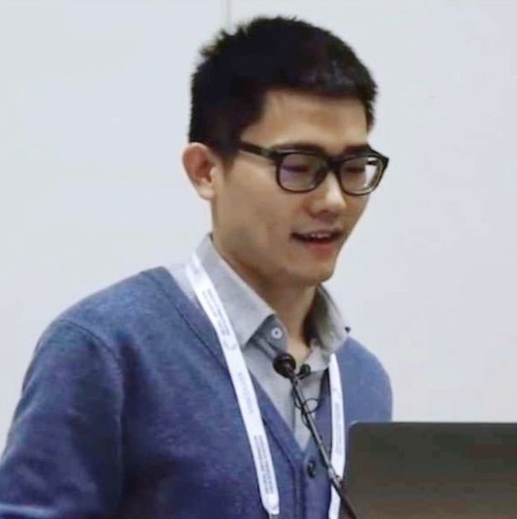

## Program Schedule
Workshop Location: Room South American A, Capital Hilton, Washington, D.C.
<a href="https://link-for-slides">slides</a>
 
  
Eastern Time

<ul>
<li> 09:00–10:30 - Session 1: Introduction, Encoding, and Training </li>
<li> 10:30-11:00 - Coffee Break </li>
<li> 11:00-12:30 - Session 2: Tasks, Table Agents, Q&A </li>
</ul>

## Tutorial Speakers

<table>
  <tbody>
    <tr>
      <td width="25%"></td>
      <td width="25%"></td>
    </tr>
    <tr>
      <td><a href="https://zorazrw.github.io/">Zora Zhiruo Wang (Carnegie Mellon University)</a></td>
      <td><a href="https://www.microsoft.com/en-us/research/people/hadong/">Haoyu Dong (Microsoft Research, Asia)</a></td>
    </tr>
  </tbody>
</table>
